# Perpuskita

Sistem informasi perpustakaan modern berbasis Next.js. Memberi pegawai tampilan kaya untuk mengelola koleksi buku, anggota, peminjaman, dan denda di atas REST API yang sudah ada.


---

## Daftar Isi

- [Cuplikan Layar](#cuplikan-layar)
- [Pendekatan Implementasi](#pendekatan-implementasi)
- [Struktur Halaman](#struktur-halaman)
- [Teknologi yang Digunakan](#teknologi-yang-digunakan)
- [Alur Data End-to-End](#alur-data-end-to-end)
- [Fitur](#fitur)
- [Struktur Proyek](#struktur-proyek)
- [Setup](#setup)
- [Scripts](#scripts)
- [Konvensi](#konvensi)
- [Catatan Backend](#catatan-backend)

---

## Cuplikan Layar

### Otentikasi & Beranda

**Halaman Masuk** — form login dengan logo brand, validasi inline, dan toggle show/hide kata sandi.

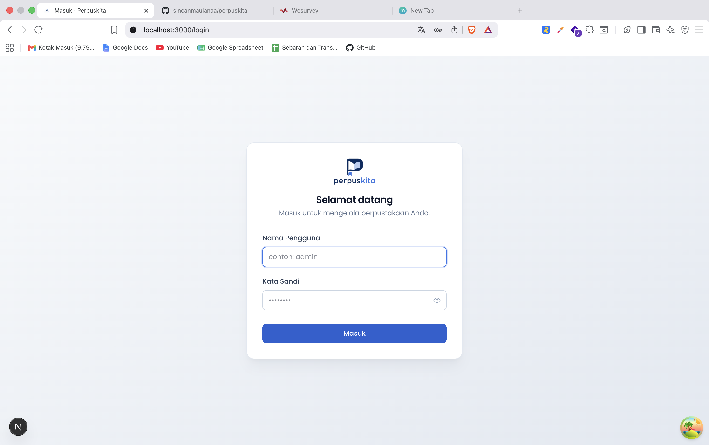

**Beranda** — empat kartu statistik (Total Buku, Total Anggota, Peminjaman Aktif, Lewat Batas), daftar lima peminjaman paling lama lewat batas, dan akumulasi total denda.

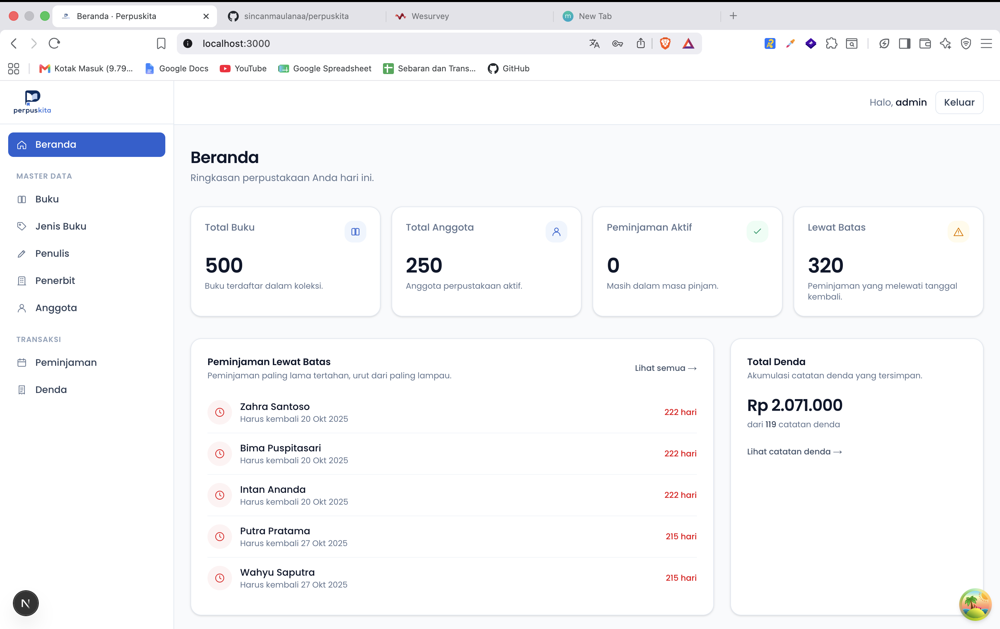

### Master Data

**Buku** — daftar koleksi dengan pencarian dan paginasi 10 baris per halaman (read-only).

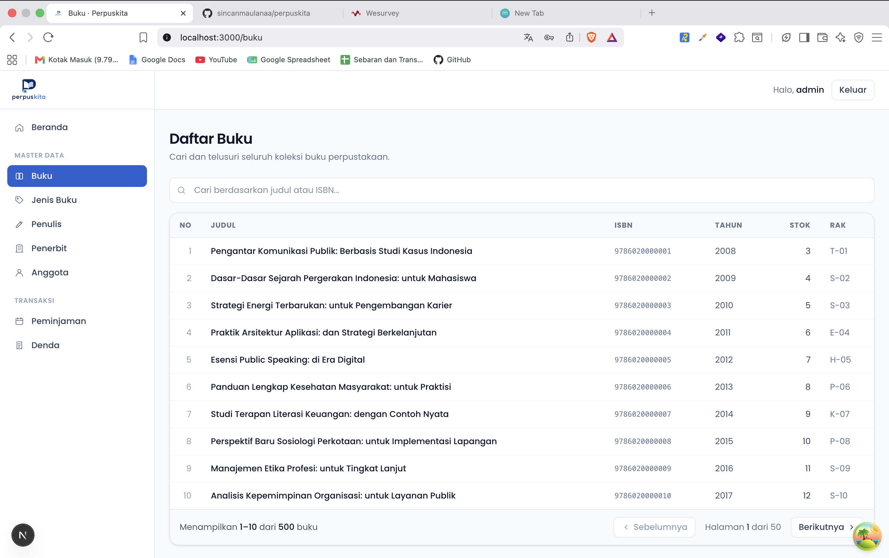

**Jenis Buku** — CRUD lengkap dengan aksi edit dan hapus per baris.

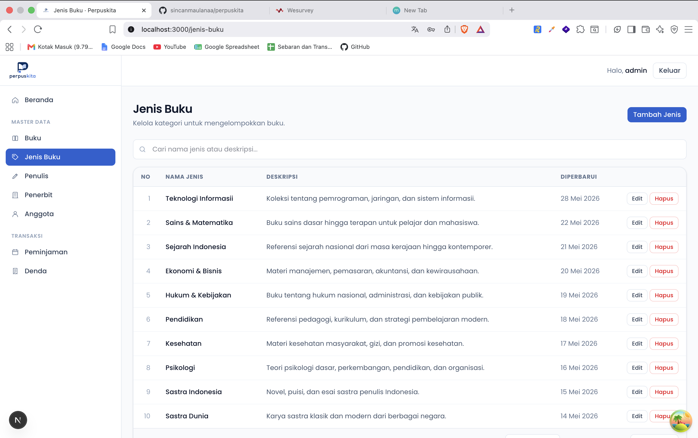

**Penulis** — daftar penulis dengan informasi alamat dan email.

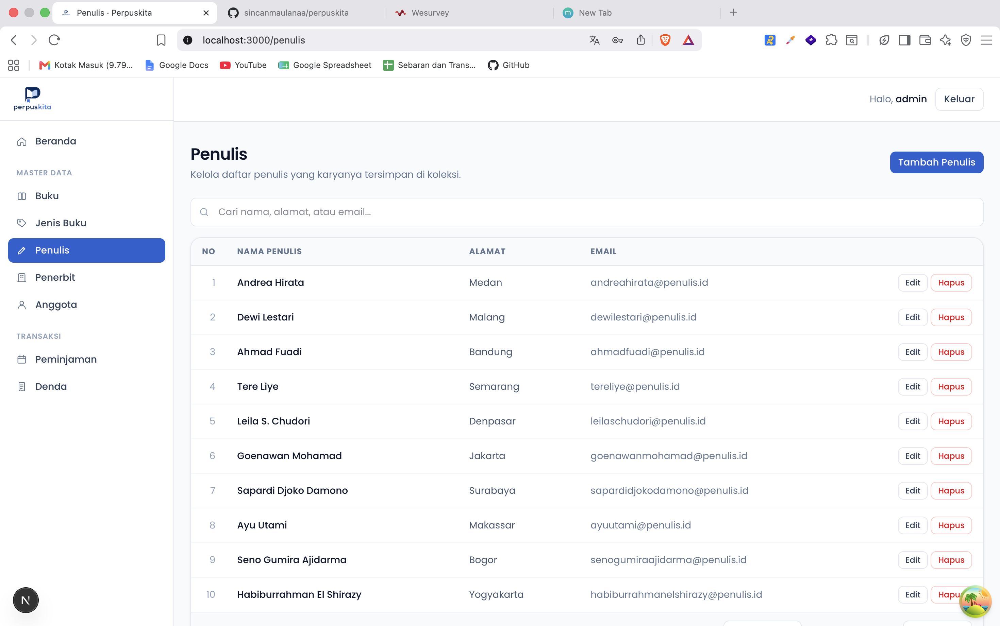

**Penerbit** — daftar penerbit dengan informasi kontak.

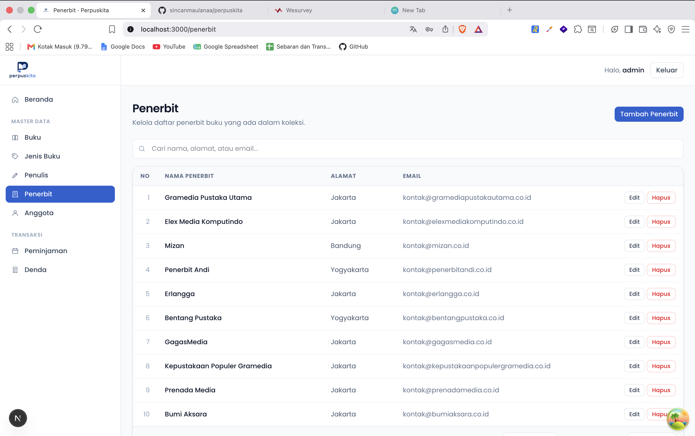

**Anggota** — daftar anggota perpustakaan terdaftar (read-only).

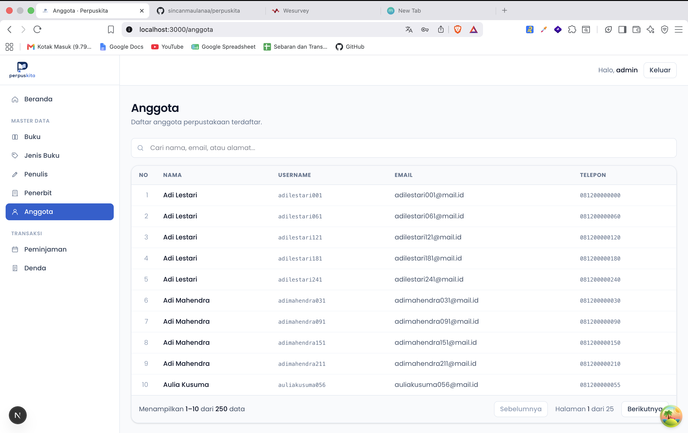

### Transaksi

**Peminjaman** — badge status lewat batas (merah) / aktif (hijau), jumlah buku per peminjaman, dan tombol aksi edit/hapus.

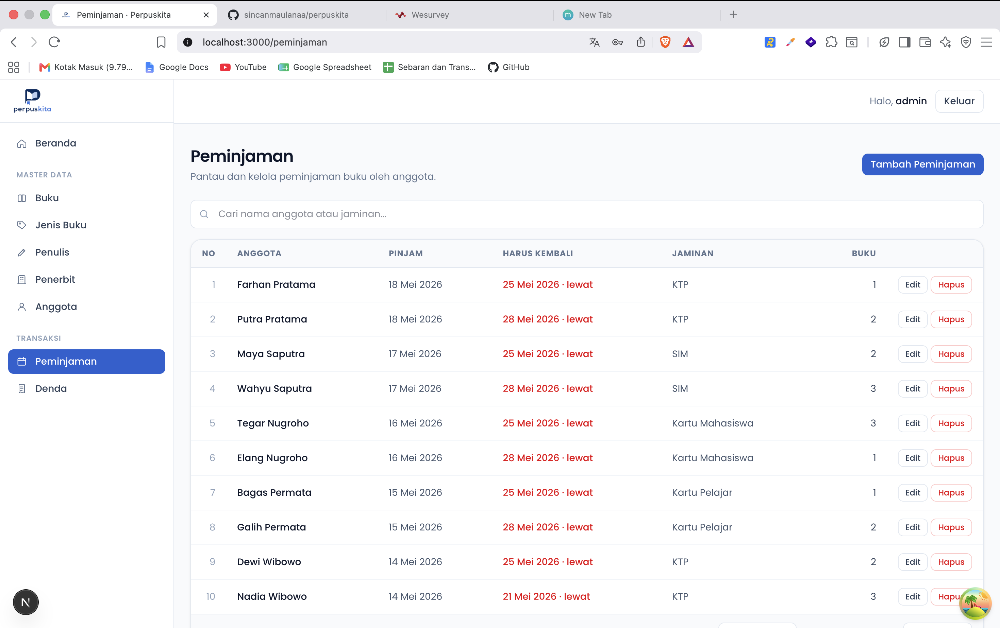

**Denda** — format Rupiah dengan locale Indonesia dan kalkulasi hari telat otomatis dari tanggal harus kembali ke tanggal kembali aktual.

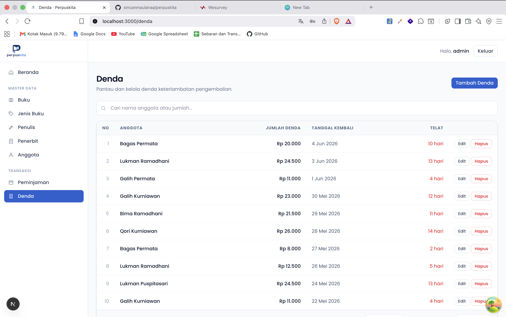

### Interaksi

**Form Tambah** — contoh halaman pembuatan jenis buku dengan validasi Zod, label & placeholder yang ramah, serta tombol Batal kembali ke daftar.

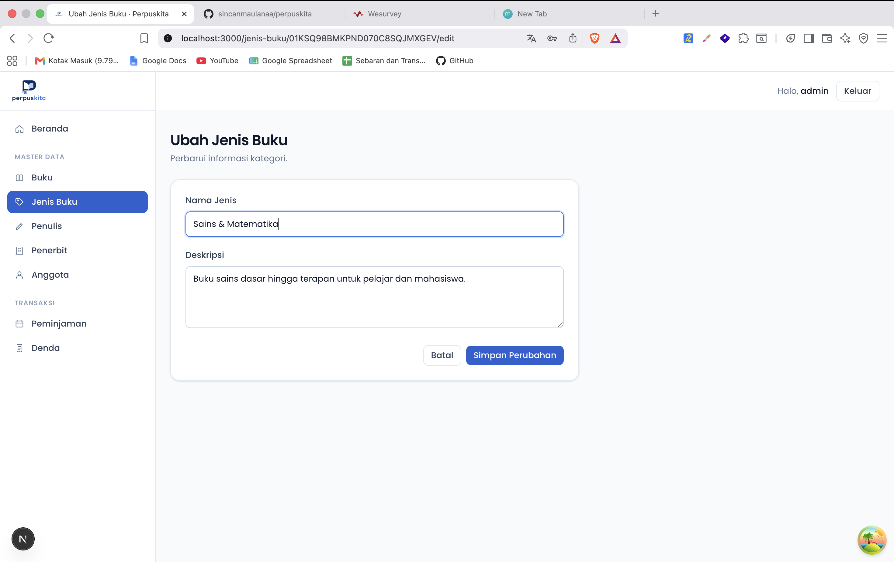

**Dialog Konfirmasi Hapus** — modal dialog (native `<dialog>`) dengan deskripsi data yang akan dihapus dan tombol destruktif berwarna merah.

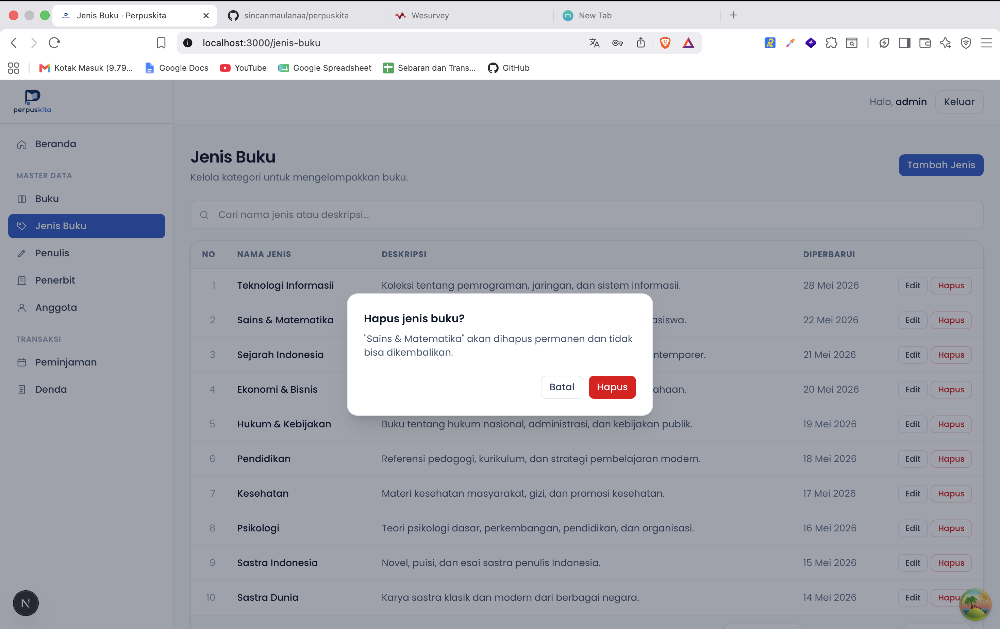

---

## Pendekatan Implementasi

### Prinsip yang Dipegang

**1. Pemisahan kepentingan yang tegas.** Tiga jenis state diperlakukan berbeda dan tidak pernah dicampur:

| Jenis state | Tools | Contoh |
|---|---|---|
| Server state (data dari backend) | TanStack Query | Daftar buku, detail peminjaman, list anggota |
| Client state (cross-component, persisted) | Zustand | Token JWT, username, sidebar drawer |
| Form state (lokal, sementara) | React Hook Form | Input field, validasi, dirty/touched flags |

Server data tidak pernah disimpan di Zustand. Form values tidak pernah dimirror ke global store. Setiap state ada di tempatnya sendiri.

**1. Feature-folder, bukan technical-layer folder.** Kode dikelompokkan per domain entitas, bukan per tipe teknis (controllers/, services/, models/). Setiap folder `features/<entity>/` self-contained dan punya semua yang dibutuhkan: types, api calls, query hooks, mutation hooks, schema validasi, dan komponen UI. Konsekuensinya: nambah fitur baru = bikin satu folder dengan template yang konsisten.

**2. Defensive frontend.** Backend punya beberapa quirk (foreign key constraint error mentah, response key tidak konsisten, validation message bocor SQL). Frontend tidak menebak-nebak: kontrak respons di-type secara tolerant, error backend di-mapping ke pesan ramah, dan setiap endpoint diuji dengan curl sebelum integrasi.

### Alur Kerja per Fitur Baru

Setiap kali nambah modul CRUD, ikuti pola yang sudah konsisten:

1. Verifikasi kontrak backend dengan curl
2. Tulis DTO types di `features/<entity>/<entity>.types.ts`
3. Tulis `api.ts` (axios calls) → `queries.ts` (hooks) → `mutations.ts` (mutate hooks)
4. Tulis Zod schema di `<entity>.schema.ts`
5. Tulis `<entity>-form.tsx` (dipakai create + edit)
6. Tulis `<entity>-list.tsx` pakai komponen `DataTable` generic
7. Tambah 4 route Next.js: list, baru, [id], [id]/edit
8. Tambah menu item di sidebar
9. Verifikasi build, lint, dan smoke-test manual
10. Commit dengan Conventional Commits, push

### Keputusan Arsitektur Penting

- **Same-origin API via Next.js rewrites**: Browser hit `/api/v1/*`, Next.js proxy ke `localhost:8001`. Hindari CORS di dev, lebih clean untuk produksi.
- **JWT di sessionStorage** (Zustand persist), bukan localStorage. Lebih pendek umur token, ada konsekuensi XSS yang sama. Untuk hardening produksi, pindah ke HttpOnly cookies.
- **Auth guard via Zustand hydration**: hook `useAuthGuard` pakai `useSyncExternalStore` untuk subscribe ke status hydration. Tidak ada flash of unauthenticated content sebelum redirect.
- **Native `<dialog>` element** untuk confirm modal. Browser handle Esc, focus trap, backdrop styling. Tidak butuh library modal.
- **DataTable generic over T**: satu komponen reusable untuk semua tabel CRUD. Search debounced, pagination client-side, kolom responsive (hide bertahap di breakpoint).

---

## Struktur Halaman

### Hirarki Routes

```
/                           Beranda (dashboard)
/login                      Halaman login (publik)

/buku                       List buku + search + pagination
/buku/[id]                  Detail buku dengan resolusi nama jenis/penulis/penerbit

/jenis-buku                 List + Tambah button
/jenis-buku/baru            Form create
/jenis-buku/[id]/edit       Form edit (prefilled)

/penulis                    List/baru/edit (pola sama)
/penerbit                   List/baru/edit
/anggota                    List (read-only)
/anggota/[id]               Detail anggota dengan kontak + identitas

/peminjaman                 List dengan badge status, jumlah_buku, search
/peminjaman/baru            Form dengan AnggotaSelect combobox
/peminjaman/[id]            Detail dengan card anggota + list buku dipinjam
/peminjaman/[id]/edit       Form edit (prefilled)

/denda                      List dengan format Rupiah, hari telat
/denda/baru                 Form dengan PeminjamanSelect (auto-fill 4 field)
/denda/[id]/edit            Form edit (prefilled)
```

### Layout & Komposisi

```
RootLayout (app/layout.tsx)
├── <html> dengan Poppins font + favicon metadata
├── <QueryProvider> (TanStack QueryClient + Toaster)
└── children
    │
    ├── /login              Tidak masuk admin shell, layout sendiri
    │
    └── (admin)/            Route group, semua protected
        └── AdminLayout     Wrap dengan AdminShell
            └── AdminShell  (client component)
                ├── useAuthGuard()  → redirect /login jika tidak auth
                ├── Sidebar (md+) atau Drawer (mobile)
                │   └── AdminSidebar
                │       ├── Brand: logo image
                │       └── 3 grup nav: Beranda · Master Data · Transaksi
                ├── Header (sticky)
                │   ├── Hamburger (mobile)
                │   ├── "Halo, {username}"
                │   └── Tombol Keluar
                └── Main
                    └── {children}        ← halaman dirender di sini
```

### Anatomi Halaman Tipikal

**List page** (contoh `/peminjaman`):
```
PageHeader: title + description + action (Tambah X button)
DataTable
├── SearchBar (debounced 250ms)
├── Loading: skeleton table dengan struktur asli
├── Error: ikon + retry button
├── Empty: ikon + pesan + CTA "Tambah X"
└── Data: header + rows + pagination
    └── Per row: kolom data + edit/delete action
```

**Form page** (contoh `/peminjaman/baru`):
```
PageHeader: title + description
Form (max-w-2xl, card)
├── Field 1: AnggotaSelect (combobox dengan backend search)
├── Field 2-3: Tanggal Pinjam, Tanggal Harus Kembali (date inputs)
├── Field 4: Jaminan (select dropdown)
└── Footer: Batal (link) + Submit (button)
```

**Detail page** (contoh `/peminjaman/[id]`):
```
BackLink (← Kembali ke daftar)
Header card: anggota name + status badge (Aktif/Lewat batas) + Edit button
Grid 2-col:
├── Card "Periode": tgl_pinjam, tgl_kembali, jaminan
└── Card "Buku Dipinjam (N)": list buku dengan judul + ISBN + kondisi
Timestamps (muted)
```

---

## Teknologi yang Digunakan

### Framework & Bahasa

- **[Next.js 16](https://nextjs.org/)** (App Router) — file-based routing, server components by default, dynamic params via async `params: Promise<...>`
- **React 19** — server components, transitions, automatic batching
- **TypeScript 5** dengan strict mode — inference akhir jadi dokumentasi terbaik

### Data & Network

- **[Axios 1.16](https://axios-http.com/)** — HTTP client. Satu instance dengan interceptor request (attach JWT) dan response (normalize ke ApiError, clear session pada 401)
- **[TanStack Query 5](https://tanstack.com/query)** — server state cache. Query keys hierarkis (`[entity, list]`, `[entity, detail, id]`), invalidation setelah mutation, retry kondisional
- **TanStack Query Devtools** (dev only) — inspect cache di browser

### State Management

- **[Zustand 5](https://github.com/pmndrs/zustand)** dengan persist middleware — auth session di sessionStorage. Selector pattern untuk subscribe spesifik
- **`useSyncExternalStore`** untuk membaca status hydration Zustand (lint-clean, React-native API)

### Form & Validation

- **[React Hook Form 7](https://react-hook-form.com/)** — uncontrolled inputs (performa lebih baik), validation pada submit, integrasi via `Controller` untuk komponen kustom (AnggotaSelect, PeminjamanSelect)
- **[Zod 4](https://zod.dev/)** — schema validation. Pesan error dalam Bahasa Indonesia langsung di schema
- **@hookform/resolvers** — bridging Zod ke React Hook Form

### Styling

- **[Tailwind CSS v4](https://tailwindcss.com/)** — atomic CSS, PostCSS-based, hot reload cepat
- **`@theme` directive** — define custom tokens. Skala warna `brand-50` sampai `brand-950` di-generate dari `#3475E9`
- **[Poppins](https://fonts.google.com/specimen/Poppins) font** via `next/font/google` — preload, no layout shift, CSS variable

### UI Feedback

- **[Sonner 2](https://sonner.emilkowal.ski/)** — toast notifications. Top-right, durasi 5s, expand mode untuk stack, rich colors

### Tooling

- **[Bun](https://bun.sh/)** — package manager, runtime untuk dev server lebih cepat dari npm
- **ESLint 9** dengan `eslint-config-next` — termasuk `react-hooks/purity` (React Compiler ready)
- **Turbopack** (default Next.js 16) — dev build cepat

### Aksesibilitas

- Native HTML semantics (`<button>`, `<dialog>`, `<table>`, `<th scope>`)
- `aria-current="page"` di nav active
- `aria-invalid`, `aria-pressed`, `aria-label` di mana relevan
- Focus ring brand-tinted di semua interactive elements
- Screen reader-friendly empty/error states (`aria-live`)

### PWA & Branding

- Favicon set lengkap (ico/svg/png/apple-touch) via `metadata.icons`
- Web manifest dengan brand color `#3475E9` dan nama konsisten
- Apple Web App tags (capable + status-bar style)


## Alur Data End-to-End

Contoh: user submit form "Tambah Jenis Buku".

```
User klik "Simpan" di /jenis-buku/baru
        ↓
React Hook Form collects field values
        ↓
Zod validates → on success, panggil onSubmit
        ↓
useCreateJenisBuku().mutateAsync(payload)
        ↓
mutationFn → jenisBukuApi.create(payload)
        ↓
api.post('/admin/buku/jenbuk/create', payload)  ← axios instance
        ↓
Request interceptor attach Authorization header dari Zustand store
        ↓
Browser hit http://localhost:3000/api/v1/admin/buku/jenbuk/create
        ↓
Next.js rewrite → http://localhost:8001/api/v1/admin/buku/jenbuk/create
        ↓
Backend Go merespons
        ↓
Response interceptor normalize success/error
        ↓
onSuccess: queryClient.invalidateQueries(jenisBukuKeys.lists())
onError: throw ApiError → caught di handleSubmit → toast.error(friendly)
        ↓
TanStack Query auto-refetch list, UI ter-update tanpa reload
        ↓
toast.success("Jenis buku berhasil ditambahkan.")
        ↓
router.push('/jenis-buku') → user kembali ke list dengan data baru
```

---

## Fitur

**Modul Master Data** — semua dengan list, detail, create, update, delete:
- Buku (read-only — endpoint create belum tersedia di backend)
- Jenis Buku
- Penulis
- Penerbit
- Anggota (read-only)

**Modul Transaksi** — full CRUD:
- Peminjaman dengan combobox pencarian anggota, badge status (aktif / lewat batas), dan halaman detail yang menampilkan daftar buku yang dipinjam
- Denda dengan form yang otomatis mengisi data peminjaman saat dipilih, format Rupiah, dan kalkulasi hari telat

**Beranda (Dashboard)**
- 4 kartu statistik (Total Buku, Total Anggota, Peminjaman Aktif, Lewat Batas)
- Daftar 5 peminjaman paling lama lewat batas
- Akumulasi total denda

**Aplikasi**
- Otentikasi JWT dengan halaman login, route guard, dan logout
- Show/hide password toggle di field login
- Sidebar responsif (drawer di mobile)
- Toast notifikasi untuk semua aksi
- Search dengan debounce di setiap list page (250ms)
- Pagination 10 baris per halaman
- Empty / loading / error state yang konsisten di semua tabel
- PWA-ready (favicon set lengkap + web manifest dengan brand color)

---

## Struktur Proyek

```
app/
├── (admin)/                     # route group untuk halaman terproteksi
│   ├── _components/             # admin shell + sidebar
│   ├── anggota/                 # list, [id]
│   ├── buku/                    # list, [id]
│   ├── denda/                   # list, baru, [id]/edit
│   ├── jenis-buku/              # list, baru, [id]/edit
│   ├── peminjaman/              # list, baru, [id], [id]/edit
│   ├── penerbit/                # list, baru, [id]/edit
│   ├── penulis/                 # list, baru, [id]/edit
│   ├── layout.tsx               # menerapkan auth guard
│   └── page.tsx                 # dashboard "/"
├── login/page.tsx               # halaman publik
├── globals.css                  # tema Tailwind + skala warna brand
└── layout.tsx                   # root layout, font, providers, metadata

features/                        # modul domain (one folder per entity)
├── anggota/
├── auth/
├── buku/
├── dashboard/
├── denda/
├── jenis-buku/
├── peminjaman/
├── penerbit/
└── penulis/
    Tiap folder berisi:
      <name>.types.ts            # DTO sesuai kontrak backend
      <name>.api.ts              # axios calls
      <name>.queries.ts          # TanStack Query hooks (useList, useById, …)
      <name>.mutations.ts        # useCreate, useUpdate, useDelete
      <name>.schema.ts           # Zod schema untuk form validation
      <name>-form.tsx            # form component (create + edit)
      <name>-list.tsx            # tabel + delete dialog
      <name>-detail.tsx          # halaman detail (jika ada)

components/ui/                   # primitif yang reusable
├── button.tsx                   # variants: primary, secondary, ghost, destructive
├── confirm-dialog.tsx           # native <dialog> untuk konfirmasi destruktif
├── data-table.tsx               # tabel generik dengan search & pagination
├── page-header.tsx
├── stat-card.tsx
├── text-field.tsx
└── textarea-field.tsx

lib/
├── api-error.ts                 # normalisasi error axios + helper pesan ramah
└── axios.ts                     # instance dengan interceptor JWT

providers/
└── query-provider.tsx           # QueryClient + Toaster
```

---

## Setup

### Prasyarat

- [Bun](https://bun.sh/) terinstal (`bun --version` ≥ 1.0)
- Backend [Golang-Perpustakaan-Restful-API](https://github.com/afrizal423/Golang-Perpustakaan-Restful-API) berjalan di `http://localhost:8001`

### Instalasi

```bash
bun install
cp .env.example .env.local
```

Edit `.env.local` jika base URL backend berbeda:

```
NEXT_PUBLIC_API_BASE_URL=/api/v1
BACKEND_API_URL=http://localhost:8001/api/v1
```

> Frontend selalu memanggil path same-origin `/api/v1/*`. Next.js merewrite ke `BACKEND_API_URL` di server, sehingga browser tidak terkena CORS.

### Menjalankan

```bash
bun dev
```

Buka [http://localhost:3000](http://localhost:3000).

Login dengan akun seed:
- **Username**: `admin`
- **Password**: `Perpus@2026`

---

## Scripts

| Perintah | Kegunaan |
|---|---|
| `bun dev` | Dev server dengan Turbopack |
| `bun run build` | Build produksi + type-check |
| `bun start` | Jalankan hasil build |
| `bun run lint` | ESLint |

---

## Konvensi

- **Naming**: kebab-case untuk file dan direktori, PascalCase untuk komponen
- **Domain language**: nama entitas tetap dalam Bahasa Indonesia (`Buku`, `Peminjaman`, `Denda`) sesuai kontrak API
- **Copy**: semua teks user-facing dalam Bahasa Indonesia natural — tidak ada jargon teknis seperti "submit", "endpoint", "validate"
- **Form**: validasi dengan Zod, error inline per field, server error via toast
- **TanStack Query**: cache key hierarkis (`[entity, list]`, `[entity, detail, id]`), invalidate setelah mutation
- **Axios interceptor**: otomatis menempelkan `Authorization: Bearer <token>` dari Zustand store, dan clear session pada response 401
- **Conventional Commits**: `feat:`, `fix:`, `chore:`, `refactor:`, `docs:`, dst. Subject ≤ 70 karakter, lowercase, imperative mood

---


